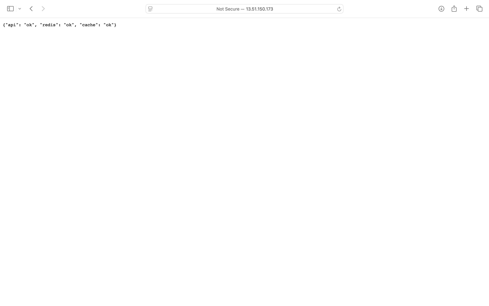
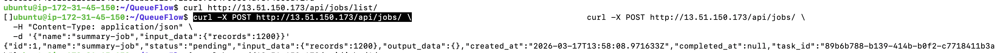
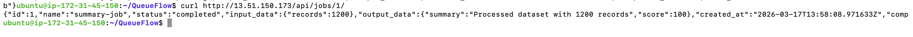

# QueueFlow

QueueFlow is a backend service for asynchronous job processing built with Django, Redis, and Celery.


## Example Workflow

### Health Check



### Create Job



### Completed Job




The system exposes a REST API where clients can create jobs. Each job is pushed to a Redis-backed queue and processed asynchronously by a Celery worker. Results are written back to the database and can be retrieved through the API.

The project demonstrates how to design and deploy a small but realistic background processing system using containerized services and cloud infrastructure.

---

## Stack

- Python
- Django
- Django REST Framework
- Celery
- Redis
- Docker
- AWS EC2
- GitHub Actions

---

## Architecture

QueueFlow uses a typical queue-based backend architecture.

Client
↓
Django API
↓
Redis (message broker)
↓
Celery Worker
↓
Database

The API receives requests and stores jobs. Tasks are pushed into Redis and picked up by Celery workers. Once processing finishes, the result is written back to the database and exposed through the API.

---

## Core Features

- Asynchronous job processing
- Redis-based task queue
- Celery worker execution
- REST API for job management
- Health monitoring endpoint
- Containerized deployment with Docker
- Running deployment on AWS EC2

---

## API

### Health Check

GET /api/health/

Example response

```json
{
  "api": "ok",
  "redis": "ok",
  "cache": "ok"
}


⸻

Create Job

POST /api/jobs/

Example request

{
  "name": "summary-job",
  "input_data": {
    "records": 1200
  }
}

Example response

{
  "id": 1,
  "status": "pending",
  "task_id": "..."
}


⸻

Get Job

GET /api/jobs/{id}/

Example response

{
  "id": 1,
  "name": "summary-job",
  "status": "completed",
  "output_data": {
    "summary": "Processed dataset with 1200 records",
    "score": 100
  }
}


⸻

List Jobs

GET /api/jobs/list/


⸻

Deployment

QueueFlow is deployed on an AWS EC2 instance using Docker containers.

The running services are:
	•	queueflow-app – Django API
	•	queueflow-worker – Celery worker
	•	queueflow-redis – Redis broker

The API is accessible through:

http://<EC2-IP>/api/health/


⸻

Local Setup

Build the image

docker build -t queueflow .

Run Redis

docker run -d --name redis redis:7

Run the API

docker run -p 8000:8000 queueflow

Start a worker

celery -A config worker -l info


⸻

CI

Basic CI checks run through GitHub Actions. The pipeline runs linting and tests on each push.

⸻

Future Improvements
	•	PostgreSQL instead of SQLite
	•	Docker Compose orchestration
	•	Gunicorn + Nginx production setup
	•	Job retry and scheduling support
	•	Monitoring and metrics

⸻
